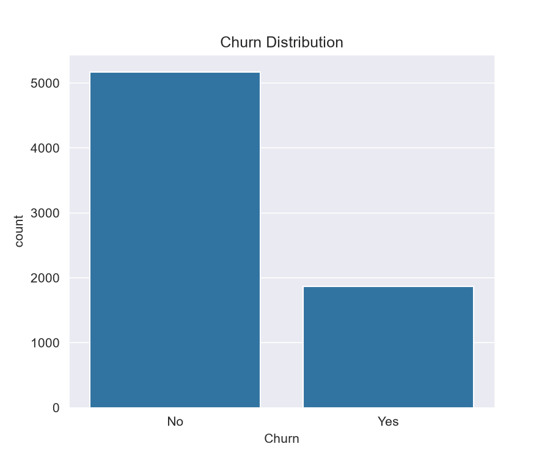
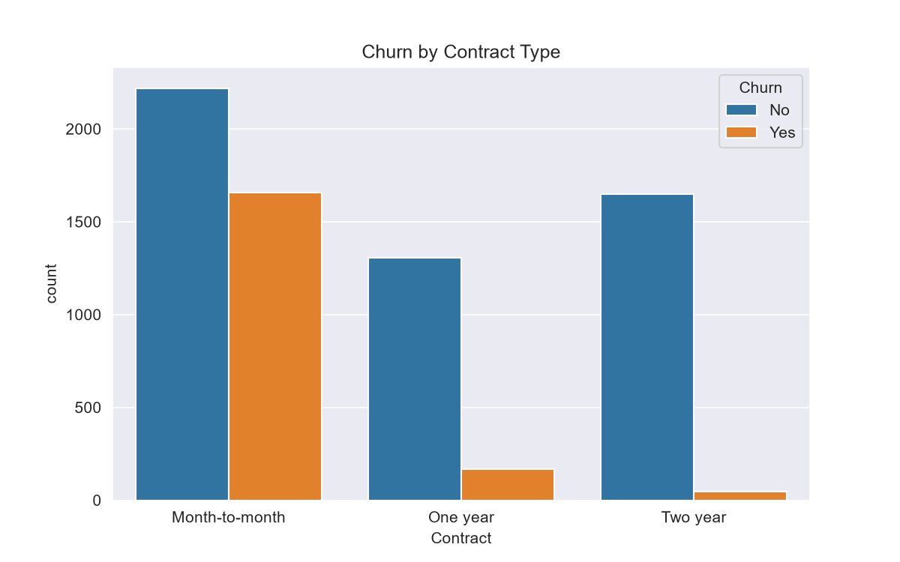
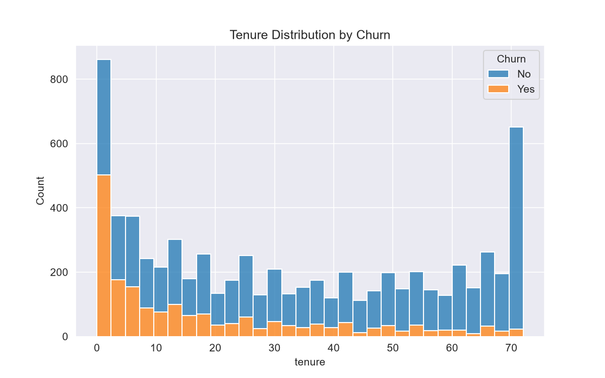
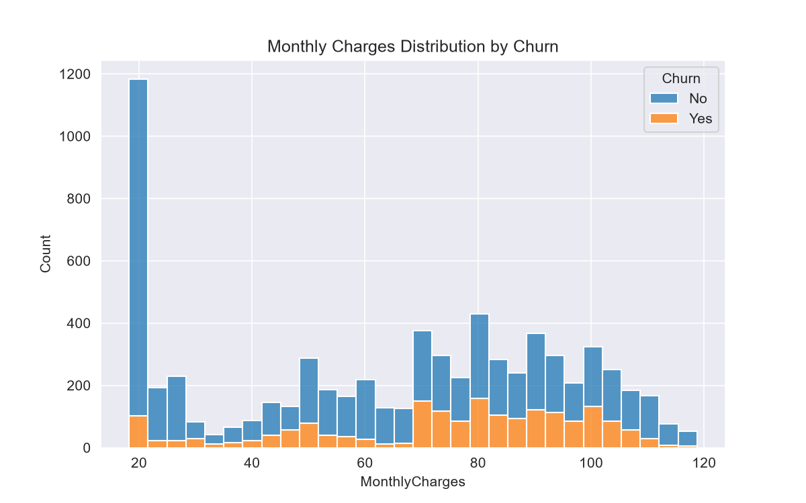
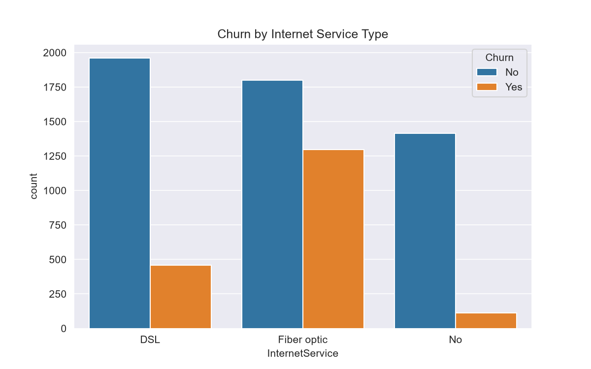
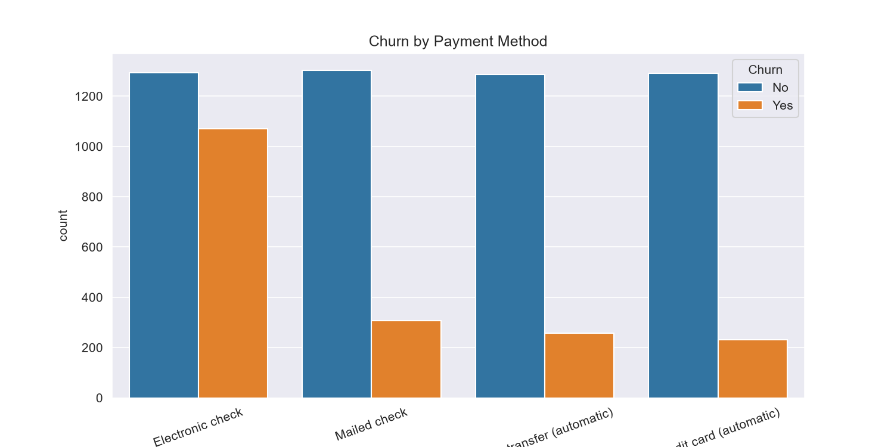
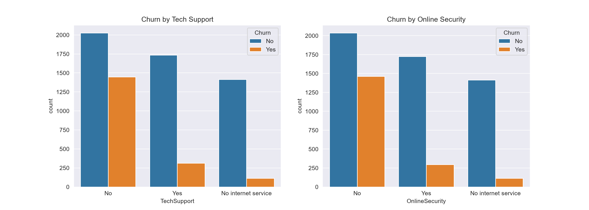
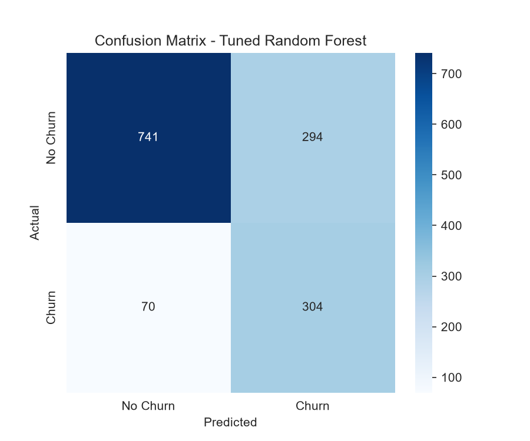
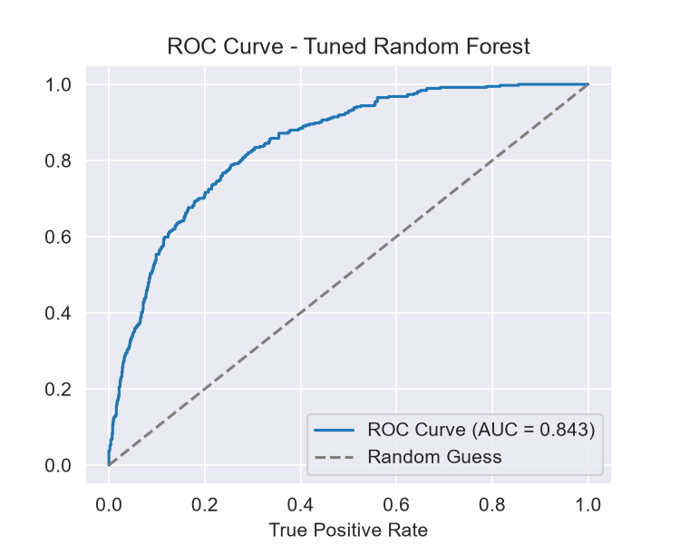
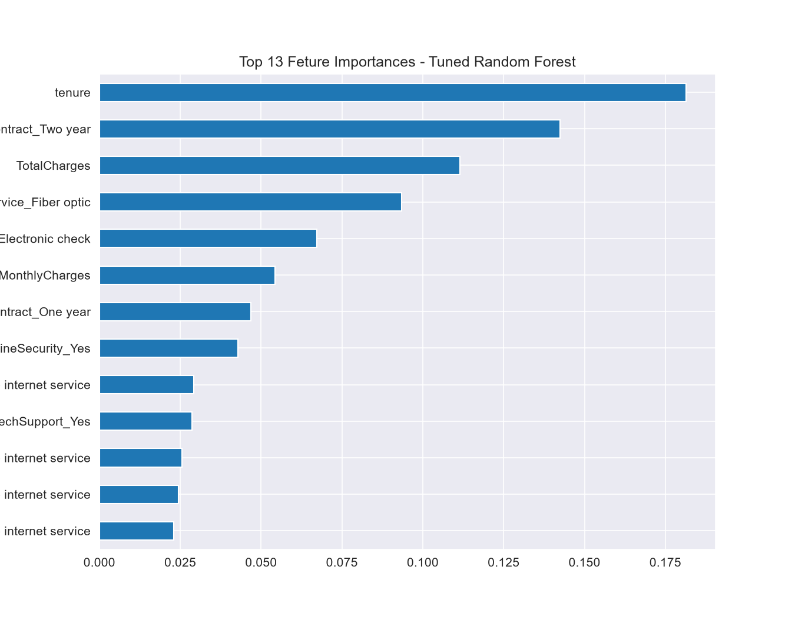

# Customer Churn Prediction

**Capstone Project**

An end-to-end machine learning pipeline predicting customer churn for a telecom provider, covering data cleaning, exploratory analysis, class-imbalance handling, hyperparameter tuning, and full evaluation with a focus on recall over raw accuracy.

## Table of Contents

- [Overview](#overview)
- [Motivation](#motivation)
- [Dataset](#dataset)
- [Methodology](#methodology)
- [Key EDA Insights](#key-eda-insights)
- [Visualizations](#visualizations)
- [Handling Class Imbalance](#handling-class-imbalance)
- [Model Tuning](#model-tuning)
- [Final Results](#final-results)
- [Feature Importance](#feature-importance)
- [Why Recall Over Accuracy](#why-recall-over-accuracy)
- [Tech Stack](#tech-stack)
- [Project Structure](#project-structure)
- [How to Run](#how-to-run)
- [Future Improvements](#future-improvements)
- [Author](#author)

## Overview

This project predicts which telecom customers are likely to churn based on account, service, and billing information, using the IBM Telco Customer Churn dataset (7,043 customers, 21 features). It's built as the capstone project closing out Phase 6 of my data science roadmap — a full pipeline from raw data to a tuned, evaluated, saved model.

## Motivation

Unlike the earlier portfolio projects in this roadmap, this capstone was built to demonstrate the complete DS workflow independently: proper data cleaning, correctly ordered train/test methodology, a genuine comparison of imbalance-handling techniques, metric-aware hyperparameter tuning, and a defensible final writeup — not just fitting a model and reporting accuracy.

## Dataset

- **Source:** IBM Telco Customer Churn dataset (Kaggle)
- **File:** `Telco-Customer-Churn.csv` — 7,043 rows × 21 columns
- **Target:** `Churn` (Yes/No) — imbalanced at 73.5% No / 26.5% Yes

## Methodology

1. **Data Cleaning** — Fixed `TotalCharges` (loaded as string due to blank values), identified all 11 blank rows corresponded to `tenure == 0` customers, filled with 0. Dropped `customerID` as a non-predictive identifier.
2. **EDA** — Explored churn against contract type, tenure, monthly charges, internet service, payment method, and support services.
3. **Feature Engineering** — Binary Yes/No columns mapped to 1/0, multi-category columns one-hot encoded (`drop_first=True` to avoid the dummy variable trap), numeric columns scaled with `StandardScaler`.
4. **Train/Test Split** — Performed *before* any imbalance handling, with stratification, to prevent synthetic or resampled data from leaking into the evaluation set.
5. **Imbalance Handling** — Compared `class_weight='balanced'` against SMOTE oversampling, across both Logistic Regression and Random Forest.
6. **Hyperparameter Tuning** — `GridSearchCV` (5-fold), explicitly optimizing for **recall** rather than accuracy, since catching actual churners is the real objective.
7. **Evaluation** — Confusion matrix, ROC-AUC, classification report, and feature importance on the final tuned model.
8. **Persistence** — Saved the trained model, scaler, and feature column order with `joblib` for reuse.

## Key EDA Insights

1. **Contract type is a major driver** — Two-year contracts have by far the lowest churn; month-to-month customers are the highest-risk group.
2. **Churn concentrates in low-tenure customers** — New customers churn heavily in their first few months; long-tenure customers are overwhelmingly loyal.
3. **Churn peaks around $70–80 monthly charges.**
4. **Fiber optic internet users churn more** than DSL or no-internet customers.
5. **Electronic check payers churn the most** among all payment methods.
6. **Lack of TechSupport or OnlineSecurity roughly triples churn rate** (~42% vs ~15%) — confirmed via exact churn-rate tables, not just visual inspection, after an initial count-plot read looked misleadingly similar.

## Visualizations

**Churn Distribution**
Overall class balance of the target variable.



**Churn by Contract Type**
Two-year contracts retain best; month-to-month churns most.



**Tenure Distribution by Churn**
Churn concentrated at low tenure, loyalty increasing with tenure.



**Monthly Charges Distribution by Churn**
Churn peaking in the $70–80 monthly charge range.



**Churn by Internet Service Type**
Fiber optic customers churning at a higher rate.



**Churn by Payment Method**
Electronic check users churning the most.



**Churn by Support Services**
TechSupport and OnlineSecurity presence strongly associated with retention.



## Handling Class Imbalance

Compared `class_weight='balanced'` against SMOTE oversampling across two models:

| Model | Accuracy | Recall (Churner) | Precision (Churner) |
|---|---|---|---|
| Logistic Regression (class_weight) | 73.9% | 0.78 | 0.51 |
| Random Forest (class_weight) | 75.2% | 0.79 | 0.52 |
| Logistic Regression (SMOTE) | 73.7% | 0.70 | 0.50 |
| Random Forest (SMOTE) | 75.2% | 0.77 | 0.52 |

**Finding:** `class_weight='balanced'` outperformed SMOTE on recall in both model types tested. This is a useful, non-obvious result — synthetic oversampling is not automatically superior, particularly with heavily one-hot encoded categorical data, where SMOTE's interpolation between points can produce less meaningful synthetic samples.

## Model Tuning

`GridSearchCV` (5-fold cross-validation) applied to Random Forest with `class_weight='balanced'`, scored on **recall** rather than accuracy:

```
Best params: {'max_depth': 6, 'min_samples_leaf': 1, 'min_samples_split': 2, 'n_estimators': 300}
Best CV recall: 0.8134
```

A shallower tree (`max_depth=6`) outperformed deeper alternatives — a concrete example of the bias-variance tradeoff in practice.

## Final Results

**Confusion Matrix**



**ROC Curve**



| Metric | Score |
|---|---|
| Accuracy | 74.2% |
| Recall (Churner) | 0.81 |
| Precision (Churner) | 0.51 |
| AUC | 0.8425 |

An AUC of 0.84 indicates strong separability between churners and non-churners across all classification thresholds, not just the default cutoff.

## Feature Importance



Top predictive features: `tenure`, `Contract_Two year`, `TotalCharges`, `InternetService_Fiber optic`, `PaymentMethod_Electronic check`, `MonthlyCharges`.

These align directly with the EDA findings above — the model learned genuine signal that matches patterns already visible in the data, rather than noise.

## Why Recall Over Accuracy

A model predicting "No Churn" for every customer would score ~73% accuracy while catching zero actual churners — useless for a retention use case. `GridSearchCV` was explicitly scored on recall so the tuned model prioritizes identifying at-risk customers, accepting more false positives (a comparatively low-cost mistake in a retention context) in exchange for catching more real churners.

## Tech Stack

- **Python 3.x**
- **pandas** / **NumPy** — data manipulation
- **Matplotlib** / **Seaborn** — visualization
- **scikit-learn** — preprocessing, `LogisticRegression`, `RandomForestClassifier`, `GridSearchCV`, evaluation metrics
- **imbalanced-learn** — `SMOTE`
- **joblib** — model persistence
- **Jupyter Notebook**

## Project Structure

```
customer-churn-prediction/
├── .ipynb_checkpoints/
├── venv/
├── Telco-Customer-Churn.csv
├── Customer_Churn_Prediction.ipynb
├── churn_distribution.png
├── churn_by_contract.png
├── tenure_by_churn.png
├── monthlycharges_by_churn.png
├── churn_by_internet.png
├── churn_by_payment.png
├── churn_by_support_services.png
├── confusion_matrix.png
├── roc_curve.png
├── feature_importance.png
├── churn_predictor.pkl
├── churn_scaler.pkl
├── churn_feature_columns.pkl
├── requirements.txt
├── .gitignore
└── README.md
```

## How to Run

1. Clone the repository
   ```bash
   git clone https://github.com/anayduggal22/customer-churn-prediction.git
   cd customer-churn-prediction
   ```
2. Create and activate a virtual environment
   ```bash
   python -m venv venv
   source venv/bin/activate   # On Windows: venv\Scripts\activate
   ```
3. Install dependencies
   ```bash
   pip install -r requirements.txt
   ```
4. Launch Jupyter and run the notebook top to bottom
   ```bash
   jupyter notebook Customer_Churn_Prediction.ipynb
   ```

To use the saved model directly without rerunning the notebook:

```python
import joblib

model = joblib.load('churn_predictor.pkl')
scaler = joblib.load('churn_scaler.pkl')
feature_columns = joblib.load('churn_feature_columns.pkl')
```

## Future Improvements

- Try XGBoost once covered in Phase 7, and compare against this Random Forest baseline
- Deploy as an interactive Streamlit app for live churn-risk scoring
- Add SHAP values for more granular, per-customer explainability
- Experiment with threshold tuning instead of relying solely on the default 0.5 cutoff

## Author

**Anay Duggal**
