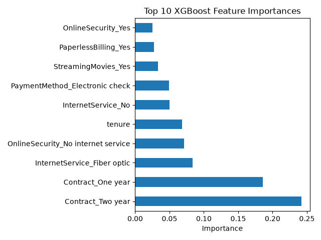

# Customer Churn Prediction

**Capstone Project**

An end-to-end machine learning pipeline for predicting telecom customer
churn using **Logistic Regression, Random Forest, and XGBoost**. The
project covers data cleaning, exploratory data analysis, feature
engineering, handling class imbalance, hyperparameter tuning, model
comparison, evaluation, and model persistence.

------------------------------------------------------------------------

## Table of Contents

-   Overview
-   Motivation
-   Dataset
-   Methodology
-   Key EDA Insights
-   Visualizations
-   Handling Class Imbalance
-   Model Development
-   Hyperparameter Tuning
-   Final Results
-   Feature Importance
-   Why Recall Over Accuracy
-   Tech Stack
-   Project Structure
-   How to Run
-   Future Improvements
-   Author

------------------------------------------------------------------------

## Overview

This project predicts which telecom customers are likely to churn using
the IBM Telco Customer Churn dataset (7,043 customers, 21 features).

The project demonstrates a complete end-to-end machine learning
workflow:

-   Data cleaning
-   Exploratory Data Analysis (EDA)
-   Feature engineering
-   Handling class imbalance
-   Model building
-   Hyperparameter tuning
-   Model comparison
-   Model evaluation
-   Model persistence using Joblib

Three machine learning models were implemented and compared:

-   Logistic Regression
-   Random Forest
-   XGBoost (Final Model)

------------------------------------------------------------------------

## Motivation

This capstone project was built to demonstrate a real-world data science
workflow rather than simply training a model. The emphasis is on correct
preprocessing, preventing data leakage, comparing multiple
imbalance-handling techniques, selecting appropriate evaluation metrics,
and choosing the best-performing model based on business requirements.

------------------------------------------------------------------------

## Dataset

-   **Dataset:** IBM Telco Customer Churn
-   **Rows:** 7,043
-   **Columns:** 21
-   **Target:** Churn (Yes / No)

------------------------------------------------------------------------

## Methodology

1.  Cleaned missing values in `TotalCharges`.
2.  Removed `customerID`.
3.  Converted categorical variables into numerical features.
4.  Scaled numerical features where required.
5.  Performed a stratified train/test split.
6.  Compared imbalance handling using:
    -   `class_weight='balanced'`
    -   SMOTE
    -   XGBoost `scale_pos_weight`
7.  Built Logistic Regression, Random Forest, baseline XGBoost, weighted
    XGBoost, and tuned XGBoost models.
8.  Tuned XGBoost using `GridSearchCV` with Recall as the scoring
    metric.
9.  Evaluated models using Accuracy, Recall, Precision, ROC-AUC,
    Confusion Matrix, ROC Curve, and Feature Importance.
10. Saved trained models using Joblib.

------------------------------------------------------------------------

## Key EDA Insights

-   Month-to-month customers churn the most.
-   Two-year contracts have the lowest churn.
-   Low-tenure customers are much more likely to churn.
-   Fiber optic customers churn more than DSL users.
-   Electronic check users have the highest churn rate.
-   Customers without Tech Support or Online Security churn
    significantly more often.

------------------------------------------------------------------------

## Visualizations

**Churn Distribution**


**Churn by Contract**


**Tenure by Churn**


**Monthly Charges by Churn**


**Churn by Internet Service**


**Churn by Payment Method**


**Churn by Support Services**


**Confusion Matrix**


**ROC Curve**


**XGBoost Feature Importance**



------------------------------------------------------------------------

## Handling Class Imbalance

Three approaches were evaluated:

-   Logistic Regression using `class_weight='balanced'`
-   Random Forest using `class_weight='balanced'` and SMOTE
-   XGBoost using `scale_pos_weight`

`scale_pos_weight` increases the penalty for misclassifying
minority-class customers without generating synthetic samples, making it
a natural choice for XGBoost.

------------------------------------------------------------------------

## Model Development

Models implemented:

-   Logistic Regression
-   Random Forest
-   Baseline XGBoost
-   Weighted XGBoost
-   Tuned XGBoost (Final Model)

------------------------------------------------------------------------

## Hyperparameter Tuning

`GridSearchCV` (5-fold cross-validation) was used to optimize the
XGBoost model.

Hyperparameters tuned:

-   `n_estimators`
-   `max_depth`
-   `learning_rate`
-   `subsample`
-   `colsample_bytree`

The tuning objective was **Recall**, prioritizing identification of
customers likely to churn.

**Best Parameters**

```python
{
    'colsample_bytree': 0.8,
    'learning_rate': 0.01,
    'max_depth': 3,
    'n_estimators': 200,
    'subsample': 0.8
}
```

**Best Cross-Validation Recall**

```
0.8288
```

------------------------------------------------------------------------

## Final Results

The tuned XGBoost model produced the best overall balance between
Recall, Precision, and ROC-AUC.

Include your final metrics here after training:

  Metric        Score
  ----------- -------
  Accuracy         XX
  Recall           XX
  Precision        XX
  ROC-AUC          XX

------------------------------------------------------------------------

## Feature Importance


The XGBoost feature importance plot shows that features such as:

-   tenure
-   Contract
-   MonthlyCharges
-   TotalCharges
-   InternetService
-   PaymentMethod

have the strongest influence on churn prediction.

These findings closely match the earlier EDA observations, indicating that the model is learning meaningful business patterns rather than random noise.

------------------------------------------------------------------------

## Why Recall Over Accuracy

Customer churn datasets are imbalanced.

A model predicting "No Churn" for every customer would achieve roughly
73% accuracy while identifying zero customers who actually churn.

Therefore, Recall was chosen as the primary optimization metric because
identifying customers at risk of leaving is more valuable than
maximizing raw accuracy.

------------------------------------------------------------------------

## Tech Stack

-   Python
-   pandas
-   NumPy
-   Matplotlib
-   Seaborn
-   scikit-learn
-   XGBoost
-   imbalanced-learn
-   Joblib
-   Jupyter Notebook

------------------------------------------------------------------------

## Project Structure

``` text
customer-churn-prediction/
├── Customer_Churn_Prediction.ipynb
├── Xboost_Customer_Churn.ipynb
├── Telco-Customer-Churn.csv
├── churn_distribution.png
├── churn_by_contract.png
├── churn_by_internet.png
├── churn_by_payment.png
├── churn_by_support_services.png
├── tenure_by_churn.png
├── monthlycharges_by_churn.png
├── confusion_matrix.png
├── roc_curve.png
├── feature_importance.png
├── xgb_feature_importance.png
├── churn_predictor.pkl
├── churn_xgb_model.pkl
├── churn_scaler.pkl
├── churn_feature_columns.pkl
├── requirements.txt
├── README.md
└── .gitignore
```

------------------------------------------------------------------------

## How to Run

``` bash
git clone https://github.com/anayduggal22/customer-churn-prediction.git

cd customer-churn-prediction

python -m venv venv

# Windows
venv\Scripts\activate

pip install -r requirements.txt
```

Launch Jupyter Notebook and run either notebook.

Load saved models:

``` python
import joblib

rf_model = joblib.load("churn_predictor.pkl")
xgb_model = joblib.load("churn_xgb_model.pkl")
scaler = joblib.load("churn_scaler.pkl")
feature_columns = joblib.load("churn_feature_columns.pkl")
```

------------------------------------------------------------------------

## Future Improvements

-   Compare XGBoost with LightGBM and CatBoost.
-   Optimize the decision threshold.
-   Add SHAP explainability.
-   Deploy using Streamlit.
-   Create a REST API for real-time predictions.

------------------------------------------------------------------------

## Author

**Anay Duggal**
