# Customer Churn Prediction

**Capstone Project**

An end-to-end machine learning pipeline for predicting telecom customer
churn using **Logistic Regression, Random Forest, XGBoost, and Ensemble
Methods (Voting + Stacking)**. The project covers data cleaning,
exploratory data analysis, feature engineering, handling class
imbalance, hyperparameter tuning, model comparison, evaluation, and
model persistence.

------------------------------------------------------------------------

## Table of Contents

-   Overview
-   Motivation
-   Dataset
-   Methodology
-   Key EDA Insights
-   Visualizations
-   Handling Class Imbalance
-   Model Development
-   Hyperparameter Tuning
-   Ensemble Models
-   Final Results — All Models Compared
-   Feature Importance
-   Why Recall Over Accuracy
-   Tech Stack
-   Project Structure
-   How to Run
-   Future Improvements
-   Author

------------------------------------------------------------------------

## Overview

This project predicts which telecom customers are likely to churn using
the IBM Telco Customer Churn dataset (7,043 customers, 21 features).

The project demonstrates a complete end-to-end machine learning
workflow:

-   Data cleaning
-   Exploratory Data Analysis (EDA)
-   Feature engineering
-   Handling class imbalance
-   Model building
-   Hyperparameter tuning
-   Ensembling (Voting + Stacking)
-   Model comparison
-   Model evaluation
-   Model persistence using Joblib

Five machine learning approaches were implemented and compared:

-   Logistic Regression
-   Random Forest (tuned — best single model on accuracy/precision balance)
-   XGBoost (tuned)
-   Voting Classifier (RF + XGBoost, soft voting)
-   Stacking Classifier (RF + XGBoost, Logistic Regression meta-model — best AUC)

------------------------------------------------------------------------

## Motivation

This capstone project was built to demonstrate a real-world data science
workflow rather than simply training a model. The emphasis is on correct
preprocessing, preventing data leakage, comparing multiple
imbalance-handling techniques, selecting appropriate evaluation metrics,
and choosing the best-performing model based on business requirements.

------------------------------------------------------------------------

## Dataset

-   **Dataset:** IBM Telco Customer Churn
-   **Rows:** 7,043
-   **Columns:** 21
-   **Target:** Churn (Yes / No) — 73.5% No, 26.5% Yes (imbalanced)

------------------------------------------------------------------------

## Methodology

1.  Cleaned missing values in `TotalCharges` (11 rows, all tenure = 0, filled with 0).
2.  Removed `customerID`.
3.  Converted categorical variables into numerical features (binary mapping + one-hot encoding).
4.  Scaled numerical features for Logistic Regression using `StandardScaler`.
5.  Performed a stratified train/test split (80/20), split **before** any resampling to prevent data leakage.
6.  Compared imbalance handling using:
    -   `class_weight='balanced'`
    -   SMOTE (Synthetic Minority Over-sampling)
    -   XGBoost's native `scale_pos_weight`
7.  Built Logistic Regression, Random Forest (baseline + SMOTE), baseline XGBoost, weighted XGBoost, and tuned XGBoost models.
8.  Tuned Random Forest and XGBoost using `GridSearchCV` (5-fold CV) with **Recall** as the scoring metric.
9.  Combined the tuned Random Forest and tuned XGBoost into a **Voting Classifier** (soft voting) and a **Stacking Classifier** (Logistic Regression meta-model).
10. Evaluated all models using Accuracy, Recall, Precision, ROC-AUC, and Confusion Matrix.
11. Saved trained models using Joblib.

------------------------------------------------------------------------

## Key EDA Insights

-   Month-to-month customers churn the most; two-year contracts have the lowest churn.
-   Low-tenure customers are much more likely to churn.
-   Fiber optic customers churn more than DSL users.
-   Electronic check users have the highest churn rate.
-   Customers without Tech Support or Online Security churn significantly more often — churn rate roughly triples (41.6% vs 15.2% for TechSupport; 41.8% vs 14.6% for OnlineSecurity).

------------------------------------------------------------------------

## Visualizations

**Churn Distribution**

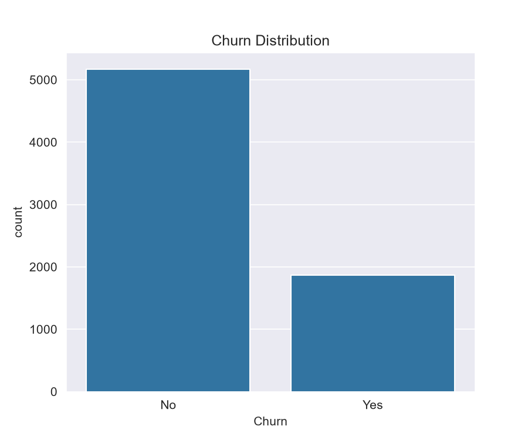

**Churn by Contract**

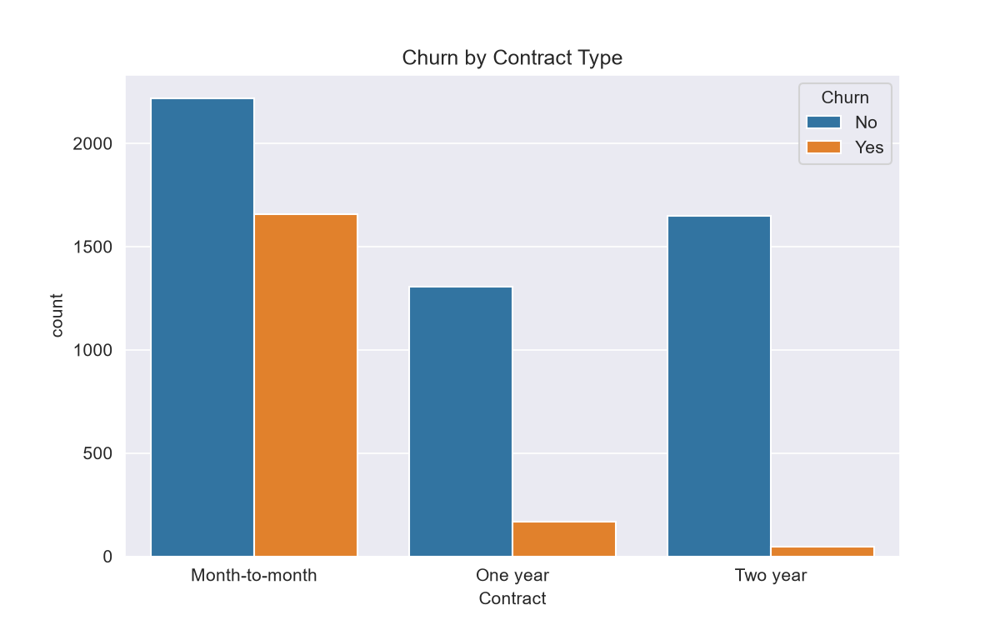

**Tenure by Churn**

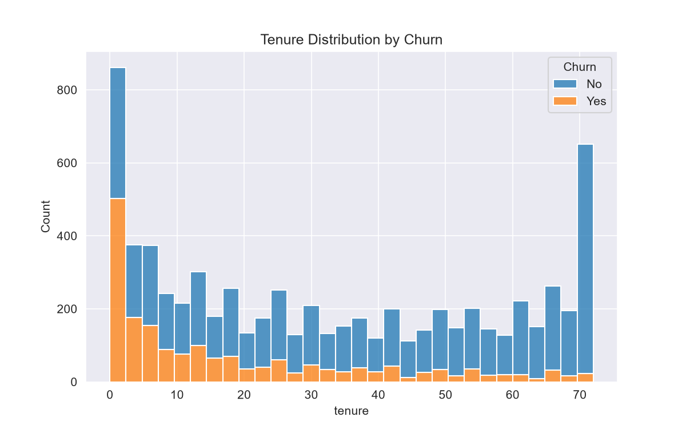

**Monthly Charges by Churn**

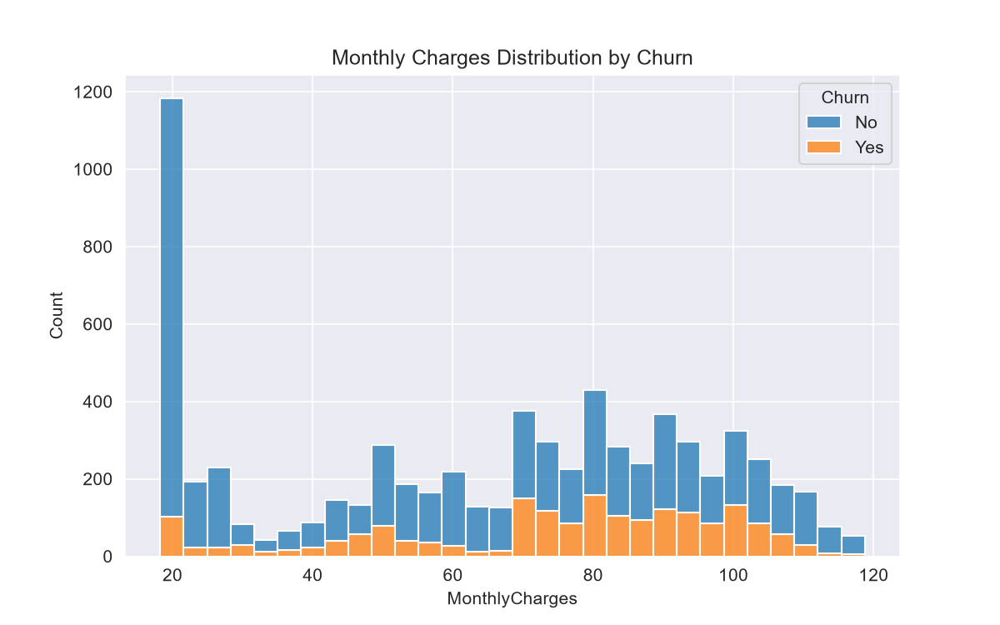

**Churn by Internet Service**

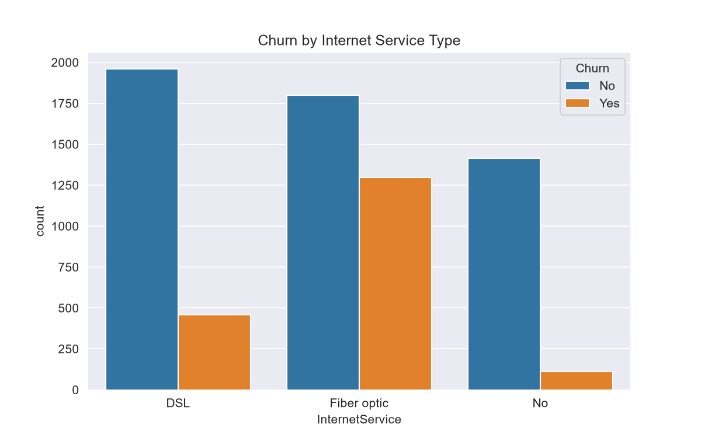

**Churn by Payment Method**

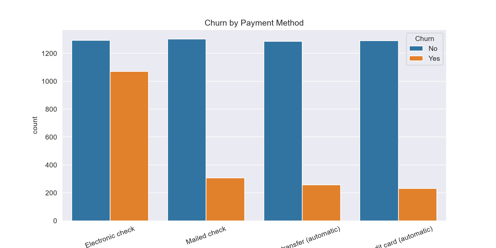

**Churn by Support Services**

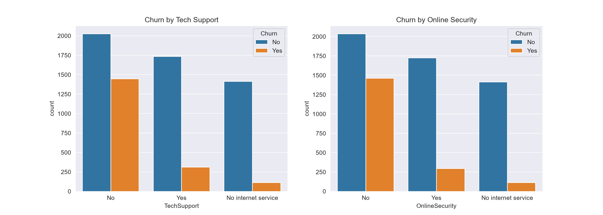

**Confusion Matrix (Tuned Random Forest)**

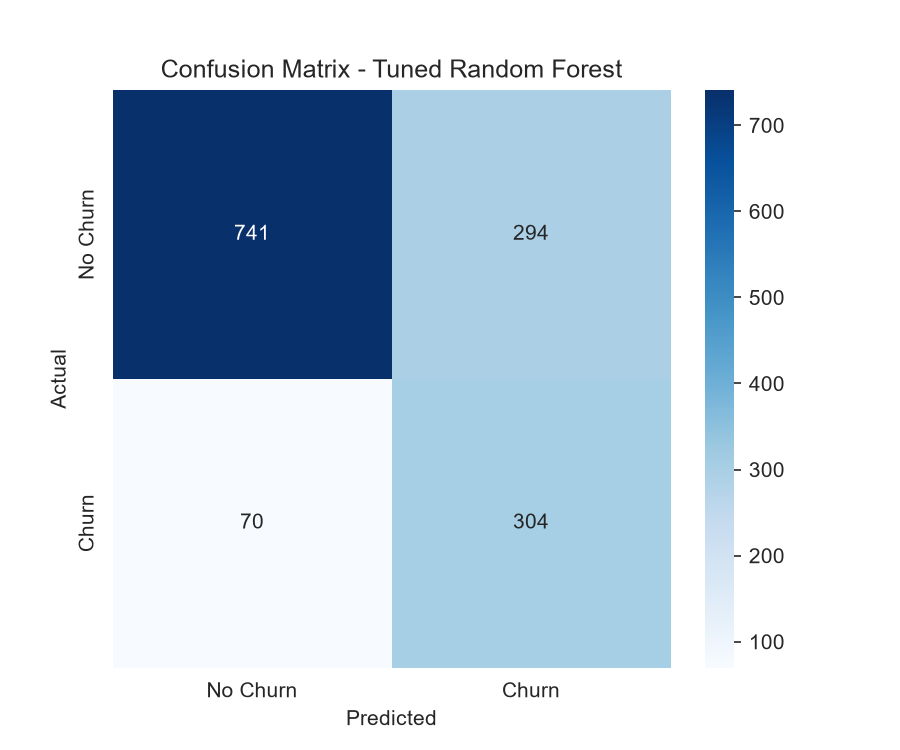

**ROC Curve (Tuned Random Forest)**

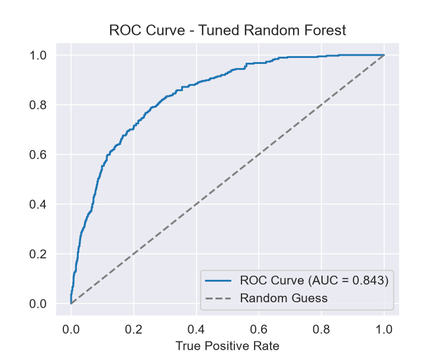

**Random Forest Feature Importance**

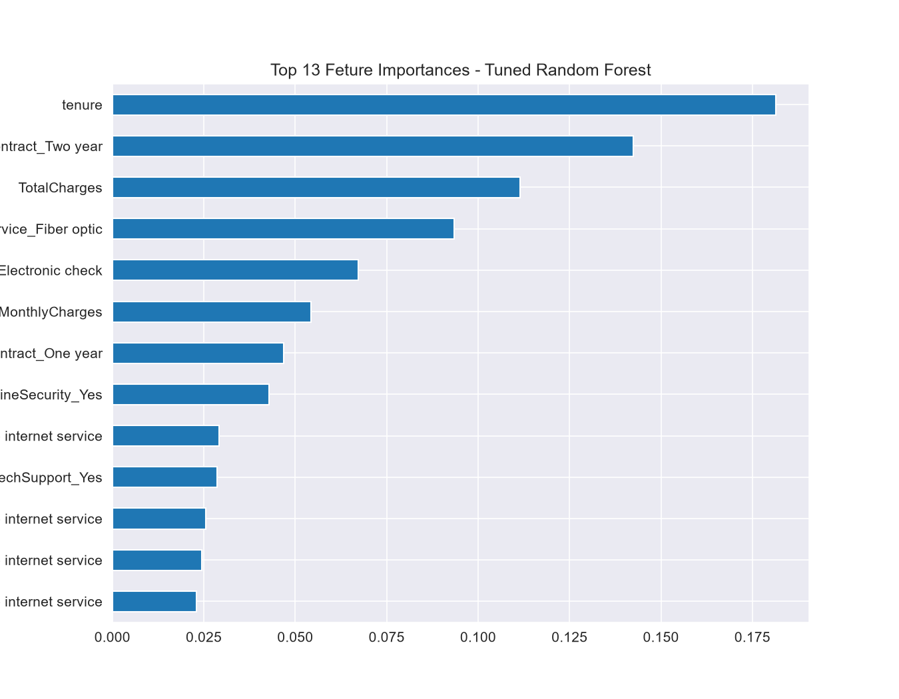

**XGBoost Feature Importance**

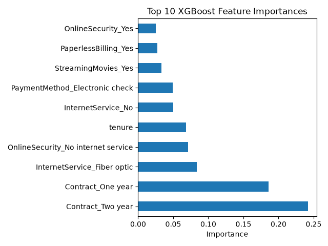

------------------------------------------------------------------------

## Handling Class Imbalance

Three approaches were evaluated:

-   Logistic Regression using `class_weight='balanced'`
-   Random Forest using `class_weight='balanced'` and separately with SMOTE
-   XGBoost using `scale_pos_weight` (calculated as 2.769 — ratio of negative to positive training samples)

**Finding:** `class_weight='balanced'` outperformed SMOTE on recall for both Logistic Regression and Random Forest — a reminder that synthetic oversampling isn't automatically superior, especially with heavily one-hot encoded data.

| Approach | Model | Accuracy | Recall | Precision |
|---|---|---|---|---|
| `class_weight='balanced'` | Logistic Regression | 0.7388 | 0.78 | 0.51 |
| `class_weight='balanced'` | Random Forest | 0.7523 | 0.79 | 0.52 |
| SMOTE | Logistic Regression | 0.7374 | 0.70 | 0.50 |
| SMOTE | Random Forest | 0.7523 | 0.77 | 0.52 |
| `scale_pos_weight` | XGBoost | 0.7672 | 0.6845 | 0.5494 |

`scale_pos_weight` increases the penalty for misclassifying minority-class customers without generating synthetic samples, making it a natural choice for XGBoost.

------------------------------------------------------------------------

## Model Development

Models implemented:

-   Logistic Regression (`class_weight='balanced'`)
-   Random Forest (`class_weight='balanced'`, tuned via GridSearchCV)
-   Baseline XGBoost
-   Weighted XGBoost (`scale_pos_weight`)
-   Tuned XGBoost (GridSearchCV)
-   Voting Classifier (RF + XGBoost, soft voting)
-   Stacking Classifier (RF + XGBoost, Logistic Regression meta-model)

------------------------------------------------------------------------

## Hyperparameter Tuning

`GridSearchCV` (5-fold cross-validation) was used to optimize both Random Forest and XGBoost, scoring on **Recall** to prioritize catching actual churners.

**Random Forest — Best Parameters**

```python
{
    'max_depth': 6,
    'min_samples_leaf': 1,
    'min_samples_split': 2,
    'n_estimators': 300
}
```
Best CV Recall: `0.8134`

**XGBoost — Best Parameters**

```python
{
    'colsample_bytree': 0.8,
    'learning_rate': 0.01,
    'max_depth': 3,
    'n_estimators': 200,
    'subsample': 0.8
}
```
Best CV Recall: `0.8288`

------------------------------------------------------------------------

## Ensemble Models

Two ensemble approaches were built by combining the tuned Random Forest and tuned XGBoost models:

-   **Voting Classifier** — soft voting (averages predicted probabilities), no additional training
-   **Stacking Classifier** — a Logistic Regression meta-model trained (via 5-fold CV) on the base models' predictions, learning when to trust each one

Both ensembles produced a small but real AUC improvement over either base model alone (0.8437 vs 0.8425), with Stacking edging ahead on accuracy and precision, and Voting keeping a slightly higher recall.

------------------------------------------------------------------------

## Final Results — All Models Compared

| Model | Accuracy | Recall | Precision | ROC-AUC |
|---|---|---|---|---|
| Logistic Regression | 73.88% | 0.78 | 0.51 | — |
| Random Forest (baseline, balanced) | 75.23% | 0.79 | 0.52 | — |
| Random Forest (tuned, final) | 74.17% | 0.81 | 0.51 | 0.8425 |
| XGBoost (baseline) | 78.78% | 0.5214 | 0.6190 | 0.8225 |
| XGBoost (weighted) | 76.72% | 0.6845 | 0.5494 | 0.8219 |
| XGBoost (tuned, final) | 73.17% | 0.8075 | 0.4967 | 0.8425 |
| **Voting Classifier (RF + XGBoost)** | 74.10% | 0.8155 | 0.5075 | **0.8437** |
| **Stacking Classifier (RF + XGBoost)** | 74.59% | 0.8102 | 0.5136 | **0.8437** |

The Stacking and Voting classifiers produced the best ROC-AUC of all models tested (0.8437), a modest but genuine improvement over the tuned Random Forest and XGBoost models alone (both at 0.8425). Combining a bagged model (RF) with a boosted model (XGBoost) gave a small edge, consistent with the two models making somewhat different errors.

------------------------------------------------------------------------

## Feature Importance

**Random Forest — Top Features**

| Feature | Importance |
|---|---|
| tenure | 0.1814 |
| Contract_Two year | 0.1425 |
| TotalCharges | 0.1115 |
| InternetService_Fiber optic | 0.0935 |
| PaymentMethod_Electronic check | 0.0673 |
| MonthlyCharges | 0.0544 |
| Contract_One year | 0.0468 |
| OnlineSecurity_Yes | 0.0429 |


**XGBoost — Top Features**


The top features from both models closely match the earlier EDA observations (tenure, contract length, internet service type, payment method), indicating the models are learning meaningful business patterns rather than random noise.

------------------------------------------------------------------------

## Why Recall Over Accuracy

Customer churn datasets are imbalanced.

A model predicting "No Churn" for every customer would achieve roughly
73% accuracy while identifying zero customers who actually churn.

Therefore, Recall was chosen as the primary optimization metric because
identifying customers at risk of leaving is more valuable than
maximizing raw accuracy — even at some cost to precision, since in a
real retention use case, a false alarm is a cheaper mistake than missing
an actual churner.

------------------------------------------------------------------------

## Tech Stack

-   Python
-   pandas
-   NumPy
-   Matplotlib
-   Seaborn
-   scikit-learn
-   XGBoost
-   imbalanced-learn
-   Joblib
-   Jupyter Notebook

------------------------------------------------------------------------

## Project Structure

``` text
customer-churn-prediction/
├── Customer_Churn_Prediction.ipynb
├── Xboost_Customer_Churn.ipynb
├── ensemble_models.ipynb
├── Telco-Customer-Churn.csv
├── churn_distribution.png
├── churn_by_contract.png
├── churn_by_internet.png
├── churn_by_payment.png
├── churn_by_support_services.png
├── tenure_by_churn.png
├── monthlycharges_by_churn.png
├── confusion_matrix.png
├── roc_curve.png
├── feature_importance.png
├── xgb_feature_importance.png
├── churn_predictor.pkl
├── churn_xgb_model.pkl
├── churn_voting_model.pkl
├── churn_stacking_model.pkl
├── churn_scaler.pkl
├── churn_feature_columns.pkl
├── requirements.txt
├── README.md
└── .gitignore
```

------------------------------------------------------------------------

## How to Run

``` bash
git clone https://github.com/anayduggal22/customer-churn-prediction.git

cd customer-churn-prediction

python -m venv venv

# Windows
venv\Scripts\activate

pip install -r requirements.txt
```

Launch Jupyter Notebook and run any of the three notebooks:
`Customer_Churn_Prediction.ipynb` (EDA + Logistic Regression + Random Forest),
`Xboost_Customer_Churn.ipynb` (XGBoost), or
`ensemble_models.ipynb` (Voting + Stacking).

Load saved models:

``` python
import joblib

rf_model = joblib.load("churn_predictor.pkl")
xgb_model = joblib.load("churn_xgb_model.pkl")
voting_model = joblib.load("churn_voting_model.pkl")
stacking_model = joblib.load("churn_stacking_model.pkl")
scaler = joblib.load("churn_scaler.pkl")
feature_columns = joblib.load("churn_feature_columns.pkl")
```

------------------------------------------------------------------------

## Future Improvements

-   Compare XGBoost with LightGBM and CatBoost.
-   Optimize the decision threshold instead of using the default 0.5.
-   Add SHAP explainability.
-   Deploy using Streamlit.
-   Create a REST API for real-time predictions.

------------------------------------------------------------------------

## Author

**Anay Duggal**
